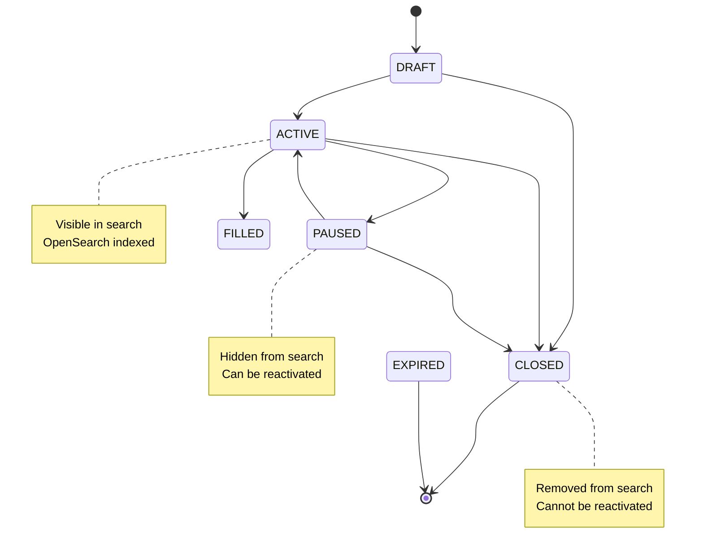

# Job Marketplace API Documentation

**Version:** 1.4.0
**Last Updated:** 2026-02-06
**Base URL:** `http://localhost:3000/api/v1`
**Authentication:** JWT Bearer Token (except where noted)

---

## Table of Contents

1. [Overview](#overview)
2. [Authentication](#authentication)
3. [Job Posting Management](#job-posting-management)
4. [Job Search & Discovery](#job-search--discovery)
5. [Map View & Geospatial](#map-view--geospatial)
6. [Saved Jobs & Searches](#saved-jobs--searches)
7. [Match Scoring & Recommendations](#match-scoring--recommendations)
8. [Background Jobs](#background-jobs)
9. [Data Models](#data-models)
10. [Error Codes](#error-codes)
11. [Performance Targets](#performance-targets)

---

## Overview

The Job Marketplace API provides comprehensive functionality for:

- **Business Owners**: Create and manage job postings with advanced filtering
- **Workers**: Search, discover, and save relevant job opportunities
- **Smart Matching**: Profile-based job recommendations with transparency
- **Geospatial Discovery**: Interactive map-based job exploration

### Key Features

- **26 REST Endpoints** across 6 functional areas
- **OpenSearch Integration** for fast, relevant search results
- **Geospatial Queries** with radius-based filtering (up to 100km)
- **Match Scoring Algorithm** with weighted factor breakdown
- **Map Clustering** with 21 zoom levels for optimal visualization
- **Background Jobs** for automation (auto-close expiry, cleanup)

### Technology Stack

- **Search Engine**: OpenSearch 2.5.0
- **Cache**: Redis 7+ (TTL: 5-60 minutes)
- **Queue**: Bull Queue (3 queues: jobs, search, notifications)
- **Distance**: Haversine formula for proximity calculations
- **Clustering**: Grid-based algorithm with viewport optimization

---

## Authentication

Most endpoints require authentication using JWT bearer tokens.

### Request Headers

```http
Authorization: Bearer <access_token>
Content-Type: application/json
```

### Example Request

```typescript
const response = await fetch('http://localhost:3000/api/v1/jobs', {
  headers: {
    'Authorization': `Bearer ${accessToken}`,
    'Content-Type': 'application/json'
  }
});
```

### Public Endpoints (No Authentication)

- `GET /jobs/search` - Job search (authentication optional for match scores)
- `GET /jobs/:id` - Get job details
- `GET /jobs/map` - Map view markers

---

## Job Posting Management

### Create Job Posting

**Endpoint:** `POST /jobs`
**Authentication:** Required (Business role)
**Description:** Create a new job posting with all required details.

#### Request Body

```typescript
{
  // Required Fields
  title: string;                    // Max 100 characters
  category: JobCategory;            // bartender, kitchen_staff, server, etc.
  description: string;              // Max 1000 characters, min 50

  // Duration & Schedule
  durationAmount: number;           // Amount (e.g., 2, 3, 4)
  durationUnit: DurationUnit;       // days, weeks, months
  scheduleType: ScheduleType;       // part_time, full_time, flexible

  // Dates
  startDate: string | null;         // ISO date or null (immediately)
  endDate: string | null;           // ISO date or null (open-ended)

  // Compensation
  compensationAmount: number;       // Must be > 0
  compensationType: CompensationType; // hourly, daily, fixed
  compensationCurrency: string;     // ISO 4217 (default: USD)

  // Requirements
  requiredExperience: ExperienceLevel; // none, basic, intermediate, advanced
  requiredLanguages: Array<{       // Optional
    language: string;              // ISO 639-1 (e.g., "en", "es")
    proficiencyLevel: CEFRLevel;   // A1, A2, B1, B2, C1, C2
  }>;

  // Location
  businessLocationId: string;       // UUID of business location

  // Optional
  skills?: string[];                // Array of skill tags
  status?: JobStatus;               // Default: DRAFT
}
```

#### Example Request

```bash
curl -X POST http://localhost:3000/api/v1/jobs \
  -H "Authorization: Bearer $TOKEN" \
  -H "Content-Type: application/json" \
  -d '{
    "title": "Summer Bartender",
    "category": "bartender",
    "description": "Looking for an experienced bartender for the summer season...",
    "durationAmount": 3,
    "durationUnit": "months",
    "scheduleType": "full_time",
    "startDate": "2026-06-01",
    "endDate": "2026-08-31",
    "compensationAmount": 15,
    "compensationType": "hourly",
    "compensationCurrency": "EUR",
    "requiredExperience": "intermediate",
    "requiredLanguages": [
      {"language": "en", "proficiencyLevel": "B2"},
      {"language": "es", "proficiencyLevel": "A2"}
    ],
    "businessLocationId": "uuid-here",
    "status": "DRAFT"
  }'
```

#### Response (201 Created)

```typescript
{
  id: string;                       // UUID
  businessId: string;               // Business owner ID
  businessLocationId: string;

  title: string;
  category: JobCategory;
  description: string;

  durationAmount: number;
  durationUnit: DurationUnit;
  scheduleType: ScheduleType;
  startDate: string | null;
  endDate: string | null;

  compensationAmount: number;
  compensationType: CompensationType;
  compensationCurrency: string;

  requiredExperience: ExperienceLevel;
  requiredLanguages: Array<{
    language: string;
    proficiencyLevel: CEFRLevel;
  }>;

  status: JobStatus;                // DRAFT, ACTIVE, PAUSED, CLOSED, EXPIRED, FILLED
  applicantCount: number;           // Default: 0
  viewCount: number;                // Default: 0

  createdAt: string;                // ISO timestamp
  updatedAt: string;
  closedAt: string | null;
}
```

#### Business Rules

- **BR-JOB-001**: Max 50 active job postings per business
- **BR-JOB-002**: Description min 50 characters
- **BR-JOB-003**: Compensation must be > 0
- **BR-JOB-005**: End date must be after start date

---

### Get Job Details

**Endpoint:** `GET /jobs/:id`
**Authentication:** Optional
**Description:** Retrieve full details of a specific job posting.

#### Example Request

```bash
curl http://localhost:3000/api/v1/jobs/uuid-here
```

#### Response (200 OK)

```typescript
{
  id: string;
  businessId: string;
  businessLocationId: string;

  // Job Details
  title: string;
  category: JobCategory;
  description: string;

  // Duration & Schedule
  durationAmount: number;
  durationUnit: DurationUnit;
  scheduleType: ScheduleType;
  startDate: string | null;
  endDate: string | null;

  // Compensation
  compensationAmount: number;
  compensationType: CompensationType;
  compensationCurrency: string;

  // Requirements
  requiredExperience: ExperienceLevel;
  requiredLanguages: Array<{
    language: string;
    proficiencyLevel: CEFRLevel;
  }>;

  // Status
  status: JobStatus;
  applicantCount: number;           // Hidden from workers
  viewCount: number;                // Visible to all

  // Metadata
  createdAt: string;
  updatedAt: string;
  closedAt: string | null;

  // Business Details (included)
  business: {
    id: string;
    name: string;
    type: BusinessType;
    primaryPhotoUrl?: string;
    location: {
      address: string;
      city: string;
      country: string;
      coordinates: { lat: number; lng: number; }
    };
    reputation: {
      averageRating: number;
      totalReviews: number;
      prestigeLevel: PrestigeLevel;
      hasGoodEmployerBadge: boolean;
    };
  };

  // Match Score (if authenticated worker)
  matchScore?: number;              // 0-100
  matchBreakdown?: {
    categoryMatch: number;          // 0-100, weight 30%
    locationProximity: number;      // 0-100, weight 25%
    languageMatch: number;          // 0-100, weight 20%
    experienceMatch: number;        // 0-100, weight 15%
    compensationMatch: number;      // 0-100, weight 10%
  };
}
```

---

### Update Job Posting

**Endpoint:** `PATCH /jobs/:id`
**Authentication:** Required (Business owner only)
**Description:** Update an existing job posting. Only allowed for DRAFT and ACTIVE statuses.

#### Request Body

Same structure as Create Job Posting (all fields optional).

#### Example Request

```bash
curl -X PATCH http://localhost:3000/api/v1/jobs/uuid-here \
  -H "Authorization: Bearer $TOKEN" \
  -H "Content-Type: application/json" \
  -d '{
    "title": "Updated Summer Bartender",
    "compensationAmount": 16
  }'
```

#### Response (200 OK)

Returns updated job object (same structure as Get Job Details).

#### Business Rules

- **BR-JOB-004**: Only active/draft jobs can be edited
- Closed jobs cannot be reactivated (create new posting instead)

---

### Change Job Status

**Endpoint:** `PATCH /jobs/:id/status`
**Authentication:** Required (Business owner only)
**Description:** Change job status (active, paused, closed).

#### Request Body

```typescript
{
  status: 'ACTIVE' | 'PAUSED' | 'CLOSED' | 'FILLED';
}
```

#### Example Request

```bash
curl -X PATCH http://localhost:3000/api/v1/jobs/uuid-here/status \
  -H "Authorization: Bearer $TOKEN" \
  -H "Content-Type: application/json" \
  -d '{"status": "ACTIVE"}'
```

#### Response (200 OK)

```typescript
{
  id: string;
  status: JobStatus;
  previousStatus: JobStatus;
  changedAt: string;                // ISO timestamp
}
```

#### Job Status Workflow



---

### List Business Jobs

**Endpoint:** `GET /businesses/:businessId/jobs`
**Authentication:** Required (Business owner or admin)
**Description:** List all job postings for a specific business.

#### Query Parameters

```typescript
{
  status?: JobStatus;               // Filter by status
  page?: number;                    // Default: 1
  limit?: number;                   // Default: 20, Max: 100
  sortBy?: 'createdAt' | 'updatedAt' | 'startDate';
  sortOrder?: 'asc' | 'desc';       // Default: desc
}
```

#### Example Request

```bash
curl "http://localhost:3000/api/v1/businesses/uuid-here/jobs?status=ACTIVE&page=1&limit=20" \
  -H "Authorization: Bearer $TOKEN"
```

#### Response (200 OK)

```typescript
{
  jobs: Array<JobPosting>;          // Job objects (abbreviated)
  pagination: {
    page: number;
    limit: number;
    total: number;
    totalPages: number;
  };
}
```

---

### Duplicate Job Posting

**Endpoint:** `POST /jobs/:id/duplicate`
**Authentication:** Required (Business owner only)
**Description:** Create a copy of an existing job posting for quick re-posting.

#### Example Request

```bash
curl -X POST http://localhost:3000/api/v1/jobs/uuid-here/duplicate \
  -H "Authorization: Bearer $TOKEN"
```

#### Response (201 Created)

```typescript
{
  id: string;                       // New job ID
  originalJobId: string;            // Source job ID
  status: 'DRAFT';                  // Always created as draft
  createdAt: string;

  // Copied fields (all except id, createdAt, updatedAt)
  title: string;
  category: JobCategory;
  description: string;
  // ... all other fields
}
```

#### Business Rules

- **BR-JOB-008**: Duplicate pre-fills data but requires confirmation
- Status always set to DRAFT (manual review before publishing)

---

## Job Search & Discovery

### Advanced Job Search

**Endpoint:** `GET /jobs/search`
**Authentication:** Optional (required for match scores)
**Description:** Search for jobs with multiple filters and geospatial queries.

#### Query Parameters

```typescript
{
  // Location-Based Search
  location?: string;                // "lat,lng" or city name
  radius?: number;                  // 5, 10, 25, 50, 100 (km)

  // Category Filters
  categories?: string;              // Comma-separated: "bartender,server"

  // Date Range
  startDateFrom?: string;           // ISO date
  startDateTo?: string;             // ISO date

  // Duration Filters
  durationMin?: number;             // Minimum duration amount
  durationMax?: number;             // Maximum duration amount
  durationUnit?: DurationUnit;      // days, weeks, months

  // Compensation Filters
  compensationMin?: number;         // Minimum compensation
  compensationMax?: number;         // Maximum compensation
  compensationCurrency?: string;    // ISO 4217 (default: USD)

  // Language Filters
  languages?: string;               // Comma-separated: "en,es,fr"

  // Experience Level
  experienceLevel?: ExperienceLevel; // none, basic, intermediate, advanced

  // Sorting
  sort?: 'relevance' | 'date' | 'compensation' | 'distance'; // Default: relevance

  // Pagination
  page?: number;                    // Default: 1
  limit?: number;                   // Default: 20, Max: 20
}
```

#### Example Request

```bash
curl "http://localhost:3000/api/v1/jobs/search?location=41.3851,2.1734&radius=25&categories=bartender,server&startDateFrom=2026-06-01&compensationMin=12&compensationCurrency=EUR&experienceLevel=intermediate&sort=distance&page=1&limit=20" \
  -H "Authorization: Bearer $TOKEN"
```

#### Response (200 OK)

```typescript
{
  jobs: Array<{
    id: string;
    title: string;
    category: JobCategory;
    description: string;            // Truncated to 200 chars

    // Location
    location: {
      address: string;
      city: string;
      country: string;
      coordinates: { lat: number; lng: number; }
    };
    distance?: number;              // Distance from search location (km)

    // Compensation
    compensation: {
      amount: number;
      type: CompensationType;
      currency: string;
    };

    // Duration
    duration: {
      amount: number;
      unit: DurationUnit;
    };

    // Schedule
    scheduleType: ScheduleType;
    startDate: string | null;
    endDate: string | null;

    // Requirements
    requiredLanguages: Array<{
      language: string;
      proficiencyLevel: CEFRLevel;
    }>;
    requiredExperience: ExperienceLevel;

    // Business Info
    business: {
      id: string;
      name: string;
      type: BusinessType;
      primaryPhotoUrl?: string;
      averageRating: number;
      totalReviews: number;
    };

    // Match Score (if authenticated worker)
    matchScore?: number;            // 0-100

    // Timestamps
    createdAt: string;
    postedAt: string;               // Alias for createdAt
  }>;

  pagination: {
    page: number;
    limit: number;
    total: number;
    totalPages: number;
  };

  // Faceted Search Counts (for filters UI)
  facets: {
    categories: Record<string, number>;    // { "bartender": 45, "server": 32 }
    experienceLevels: Record<string, number>;
    scheduleTypes: Record<string, number>;
  };

  // Applied Filters (for display)
  appliedFilters: {
    location?: { lat: number; lng: number; radius: number; };
    categories?: string[];
    startDateRange?: { from: string; to: string; };
    durationRange?: { min: number; max: number; unit: DurationUnit; };
    compensationRange?: { min: number; max: number; currency: string; };
    languages?: string[];
    experienceLevel?: ExperienceLevel;
  };
}
```

#### Business Rules

- **BR-SEARCH-001**: Max 100km radius
- **BR-SEARCH-003**: Max 20 results per page
- **BR-SEARCH-006**: Default sort by relevance (match score)

#### Performance Target

- **REQ-NFR-JOB-001**: Search must return results within 2 seconds

---

### Faceted Search Reference

**Category Options:**
- `bartender` - Bar and beverage service
- `kitchen_staff` - Kitchen and culinary roles
- `server` - Table service and waitstaff
- `housekeeping` - Cleaning and maintenance
- `retail` - Retail sales and customer service
- `tour_guide` - Tour and activity leadership
- `receptionist` - Front desk and guest services
- `other` - Miscellaneous roles

**Experience Levels:**
- `none` - No experience required
- `basic` - Entry-level (0-6 months)
- `intermediate` - Some experience (6 months - 2 years)
- `advanced` - Significant experience (2+ years)

**Schedule Types:**
- `part_time` - Less than 30 hours/week
- `full_time` - 30+ hours/week
- `flexible` - Variable schedule

**Compensation Types:**
- `hourly` - Per hour rate
- `daily` - Per day rate
- `fixed` - Fixed total amount

---

## Map View & Geospatial

### Get Map Markers

**Endpoint:** `GET /jobs/map`
**Authentication:** Optional
**Description:** Retrieve job postings within a map viewport with clustering.

#### Query Parameters

```typescript
{
  // Viewport Bounds (Required)
  bounds: {
    south: number;                  // Latitude
    west: number;                   // Longitude
    north: number;                  // Latitude
    east: number;                   // Longitude
  };

  // Zoom Level (Required)
  zoom: number;                     // 1-20 (used for clustering)

  // Optional Filters
  categories?: string;              // Comma-separated
  experienceLevel?: ExperienceLevel;
}
```

#### Example Request

```bash
curl "http://localhost:3000/api/v1/jobs/map?south=41.37&west=2.15&north=41.41&east=2.19&zoom=13&categories=bartender,server"
```

#### Response (200 OK)

```typescript
{
  clusters: Array<{
    id: string;                     // Cluster ID
    position: {
      lat: number;
      lng: number;
    };
    count: number;                  // Number of jobs in cluster
    categories: string[];           // Top categories in cluster
    zoomLevel: number;              // Zoom at which cluster expands
  }>;

  singleMarkers: Array<{
    id: string;                     // Job ID
    position: {
      lat: number;
      lng: number;
    };
    title: string;
    category: JobCategory;
    compensation: {
      amount: number;
      currency: string;
    };
    businessName: string;
    averageRating: number;
  }>;

  metadata: {
    totalJobs: number;              // Jobs in viewport
    clustered: number;              // Jobs in clusters
    visible: number;                // Individual markers
    zoomLevel: number;
  };
}
```

#### Map Clustering Algorithm

**Grid-Based Clustering with 21 Zoom Levels:**

```typescript
// Cluster Grid Size by Zoom Level
const CLUSTER_GRIDS = {
  1-5: 50 km,      // Country level
  6-10: 10 km,     // City level
  11-15: 2 km,     // Neighborhood level
  16-20: 0.5 km    // Street level
};

// Clustering Logic
function clusterJobs(jobs, zoom, bounds) {
  const gridSize = CLUSTER_GRIDS[zoom];
  const clusters = new Map();

  jobs.forEach(job => {
    const gridX = Math.floor(job.lng / gridSize);
    const gridY = Math.floor(job.lat / gridSize);
    const clusterId = `${gridX}:${gridY}`;

    if (!clusters.has(clusterId)) {
      clusters.set(clusterId, {
        id: clusterId,
        position: calculateCentroid(gridX, gridY),
        count: 0,
        jobs: []
      });
    }

    clusters.get(clusterId).jobs.push(job);
    clusters.get(clusterId).count++;
  });

  return {
    clusters: Array.from(clusters.values()),
    singleMarkers: jobs // All visible markers
  };
}
```

#### Business Rules

- **BR-SEARCH-002**: Max 100 markers (apply clustering)
- Clusters auto-expand at higher zoom levels

#### Performance Target

- **REQ-NFR-JOB-002**: Map must load within 3 seconds

---

## Saved Jobs & Searches

### Save Job

**Endpoint:** `POST /workers/me/saved-jobs`
**Authentication:** Required (Worker role)
**Description:** Save a job posting for later reference.

#### Request Body

```typescript
{
  jobId: string;                    // Job UUID
  notes?: string;                   // Optional notes (max 500 chars)
}
```

#### Example Request

```bash
curl -X POST http://localhost:3000/api/v1/workers/me/saved-jobs \
  -H "Authorization: Bearer $TOKEN" \
  -H "Content-Type: application/json" \
  -d '{
    "jobId": "uuid-here",
    "notes": "Great compensation, flexible schedule"
  }'
```

#### Response (201 Created)

```typescript
{
  id: string;                       // SavedJob ID
  workerId: string;
  jobId: string;
  notes: string | null;
  createdAt: string;

  // Job details (included)
  job: {
    id: string;
    title: string;
    category: JobCategory;
    businessName: string;
    location: { city: string; country: string; };
    compensation: { amount: number; currency: string; };
    status: JobStatus;
  };
}
```

#### Business Rules

- **BR-SEARCH-005**: Max 20 saved jobs per worker

---

### List Saved Jobs

**Endpoint:** `GET /workers/me/saved-jobs`
**Authentication:** Required (Worker role)
**Description:** Retrieve all saved jobs for the current worker.

#### Query Parameters

```typescript
{
  page?: number;                    // Default: 1
  limit?: number;                   // Default: 20
  sortBy?: 'createdAt' | 'jobStartDate'; // Default: createdAt
}
```

#### Example Request

```bash
curl "http://localhost:3000/api/v1/workers/me/saved-jobs?page=1&limit=20" \
  -H "Authorization: Bearer $TOKEN"
```

#### Response (200 OK)

```typescript
{
  savedJobs: Array<{
    id: string;
    jobId: string;
    notes: string | null;
    createdAt: string;
    job: { /* Job object */ };
  }>;
  pagination: {
    page: number;
    limit: number;
    total: number;
    totalPages: number;
  };
}
```

---

### Unsave Job

**Endpoint:** `DELETE /workers/me/saved-jobs/:id`
**Authentication:** Required (Worker role)
**Description:** Remove a job from saved jobs.

#### Example Request

```bash
curl -X DELETE http://localhost:3000/api/v1/workers/me/saved-jobs/uuid-here \
  -H "Authorization: Bearer $TOKEN"
```

#### Response (204 No Content)

---

### Save Search

**Endpoint:** `POST /workers/me/saved-searches`
**Authentication:** Required (Worker role)
**Description:** Save search filters for quick access and notifications.

#### Request Body

```typescript
{
  name: string;                     // Max 50 characters
  filters: {
    location?: {
      latitude: number;
      longitude: number;
      radius: number;               // 5, 10, 25, 50, 100 (km)
    };
    categories?: string[];          // Job categories
    startDateRange?: {
      from: string;                 // ISO date
      to: string;                   // ISO date
    };
    duration?: {
      min: number;
      max: number;
      unit: DurationUnit;
    };
    compensationRange?: {
      min: number;
      max: number;
      currency: string;
    };
    languages?: string[];
    experienceLevel?: ExperienceLevel;
  };
  notificationEnabled?: boolean;    // Default: true
}
```

#### Example Request

```bash
curl -X POST http://localhost:3000/api/v1/workers/me/saved-searches \
  -H "Authorization: Bearer $TOKEN" \
  -H "Content-Type: application/json" \
  -d '{
    "name": "Barcelona Summer Jobs",
    "filters": {
      "location": { "latitude": 41.3851, "longitude": 2.1734, "radius": 25 },
      "categories": ["bartender", "server"],
      "startDateRange": { "from": "2026-06-01", "to": "2026-09-01" },
      "compensationRange": { "min": 12, "max": 20, "currency": "EUR" }
    },
    "notificationEnabled": true
  }'
```

#### Response (201 Created)

```typescript
{
  id: string;                       // SavedSearch ID
  workerId: string;
  name: string;
  filters: { /* Filter object */ };
  notificationEnabled: boolean;
  createdAt: string;
  lastUsedAt: string | null;
}
```

#### Business Rules

- **BR-SEARCH-003**: Max 5 saved searches per worker
- **BR-SEARCH-004**: Auto-archive after 90 days of inactivity

---

### List Saved Searches

**Endpoint:** `GET /workers/me/saved-searches`
**Authentication:** Required (Worker role)

#### Example Request

```bash
curl http://localhost:3000/api/v1/workers/me/saved-searches \
  -H "Authorization: Bearer $TOKEN"
```

#### Response (200 OK)

```typescript
{
  savedSearches: Array<{
    id: string;
    name: string;
    filters: { /* Filter object */ };
    notificationEnabled: boolean;
    createdAt: string;
    lastUsedAt: string | null;
    newJobsCount?: number;          // New matching jobs since last check
  }>;
}
```

---

### Delete Saved Search

**Endpoint:** `DELETE /workers/me/saved-searches/:id`
**Authentication:** Required (Worker role)

#### Example Request

```bash
curl -X DELETE http://localhost:3000/api/v1/workers/me/saved-searches/uuid-here \
  -H "Authorization: Bearer $TOKEN"
```

#### Response (204 No Content)

---

## Match Scoring & Recommendations

### Get Job Recommendations

**Endpoint:** `GET /jobs/recommendations`
**Authentication:** Required (Worker role)
**Description:** Get personalized job recommendations based on worker profile.

#### Query Parameters

```typescript
{
  minMatchScore?: number;           // Default: 40, Range: 0-100
  limit?: number;                   // Default: 10, Max: 50
}
```

#### Example Request

```bash
curl "http://localhost:3000/api/v1/jobs/recommendations?minMatchScore=60&limit=20" \
  -H "Authorization: Bearer $TOKEN"
```

#### Response (200 OK)

```typescript
{
  jobs: Array<{
    id: string;
    title: string;
    category: JobCategory;
    description: string;            // Truncated

    // Location
    location: {
      city: string;
      country: string;
      coordinates: { lat: number; lng: number; }
    };
    distanceFromWorker?: number;    // km

    // Compensation
    compensation: {
      amount: number;
      type: CompensationType;
      currency: string;
    };

    // Match Score
    matchScore: number;             // 0-100
    matchBreakdown: {
      categoryMatch: {
        score: number;              // 0-100
        weight: number;             // 0.30 (30%)
        details: string;            // Explanation
      };
      locationProximity: {
        score: number;              // 0-100
        weight: number;             // 0.25 (25%)
        details: string;
      };
      languageMatch: {
        score: number;              // 0-100
        weight: number;             // 0.20 (20%)
        details: string;
      };
      experienceMatch: {
        score: number;              // 0-100
        weight: number;             // 0.15 (15%)
        details: string;
      };
      compensationMatch: {
        score: number;              // 0-100
        weight: number;             // 0.10 (10%)
        details: string;
      };
    };

    // Business Info
    business: {
      name: string;
      averageRating: number;
      hasGoodEmployerBadge: boolean;
    };
  }>;

  algorithm: 'profile_match_v1';
  generatedAt: string;              // ISO timestamp
  cacheStatus: 'hit' | 'miss';      // Redis cache (15 min TTL)
}
```

#### Match Scoring Algorithm

```typescript
// Weighted Match Score Formula
Match Score = (
  (Category Match × 30%) +
  (Location Proximity × 25%) +
  (Language Match × 20%) +
  (Experience Match × 15%) +
  (Compensation Match × 10%)
)

// Factor Calculations:

// 1. Category Match (30%)
// 100 if worker prefers this category, 0 otherwise
const categoryMatch = worker.preferredCategories.includes(job.category) ? 100 : 0;

// 2. Location Proximity (25%)
// 100 if within preferred radius, linear decay to 0 at 2× preferred distance
const distance = haversine(worker.location, job.location);
const preferredRadius = worker.preferredLocationRadius || 50; // km
const locationProximity = distance <= preferredRadius
  ? 100
  : Math.max(0, 100 - ((distance - preferredRadius) / preferredRadius) * 100);

// 3. Language Match (20%)
// Percentage of required languages worker meets or exceeds
const languageMatches = job.requiredLanguages.filter(reqLang => {
  const workerLang = worker.languages.find(w => w.language === reqLang.language);
  return workerLang && workerLang.proficiencyLevel >= reqLang.proficiencyLevel;
});
const languageMatch = (languageMatches.length / job.requiredLanguages.length) * 100;

// 4. Experience Match (15%)
// 100 if meets requirement, 50 if one level below, 0 otherwise
const experienceLevels = { none: 0, basic: 1, intermediate: 2, advanced: 3 };
const workerLevel = experienceLevels[worker.experienceLevel] || 0;
const requiredLevel = experienceLevels[job.requiredExperience] || 0;
const experienceMatch =
  workerLevel >= requiredLevel ? 100 :
  workerLevel === requiredLevel - 1 ? 50 : 0;

// 5. Compensation Match (10%)
// 100 if within expected range, linear decay to 0 outside range
const compensationMatch =
  job.compensationAmount >= worker.expectedCompensationMin &&
  job.compensationAmount <= worker.expectedCompensationMax ? 100 :
  job.compensationAmount < worker.expectedCompensationMin
    ? Math.max(0, (job.compensationAmount / worker.expectedCompensationMin) * 100)
    : Math.max(0, 100 - ((job.compensationAmount - worker.expectedCompensationMax) / worker.expectedCompensationMax) * 100);

// Final Score (0-100)
const finalScore = (
  (categoryMatch * 0.30) +
  (locationProximity * 0.25) +
  (languageMatch * 0.20) +
  (experienceMatch * 0.15) +
  (compensationMatch * 0.10)
);
```

#### Business Rules

- **BR-MATCH-001**: Weighted scoring algorithm (see formula above)
- **BR-MATCH-002**: Jobs below 40% match score excluded from recommendations
- **BR-MATCH-003**: Scores recalculated on profile update (cache invalidation)

#### Performance Target

- **REQ-NFR-JOB-004**: Match scoring < 500ms for 500 jobs

---

### Get Top Matches for Business

**Endpoint:** `GET /businesses/:businessId/top-matches`
**Authentication:** Required (Business role)
**Description:** Get workers who match well with a specific job posting.

#### Query Parameters

```typescript
{
  jobId?: string;                   // Filter by specific job
  minMatchScore?: number;           // Default: 60
  limit?: number;                   // Default: 10, Max: 50
}
```

#### Example Request

```bash
curl "http://localhost:3000/api/v1/businesses/uuid-here/top-matches?jobId=job-uuid&minMatchScore=70&limit=20" \
  -H "Authorization: Bearer $TOKEN"
```

#### Response (200 OK)

```typescript
{
  workers: Array<{
    id: string;
    firstName: string;
    lastName: string;
    profilePhotoUrl?: string;

    // Profile Summary
    location: { city: string; country: string; };
    preferredCategories: string[];
    languages: Array<{ language: string; proficiencyLevel: CEFRLevel; }>;
    experienceLevel: ExperienceLevel;

    // Match Score
    matchScore: number;             // 0-100
    matchBreakdown: { /* Same structure as worker recommendations */ };

    // Reputation
    averageRating?: number;
    totalReviews?: number;
    prestigeLevel?: PrestigeLevel;
  }>;
  algorithm: 'job_match_v1';
  generatedAt: string;
}
```

---

## Background Jobs

### Job Queues

The system uses **Bull Queue** for background processing with 3 queues:

1. **jobs-queue** - Job lifecycle operations
2. **search-queue** - OpenSearch indexing and sync
3. **notifications-queue** - Alert notifications

---

### Auto-Close Expired Jobs

**Schedule:** Daily at 23:59 UTC
**Queue:** `jobs-queue`
**Job Name:** `auto-close-expired-jobs`

#### Description

Automatically closes job postings whose end date has passed.

#### Process

```typescript
// 1. Query expired jobs
const expiredJobs = await prisma.jobPosting.findMany({
  where: {
    status: { in: ['ACTIVE', 'PAUSED'] },
    endDate: { lt: new Date() }
  }
});

// 2. Update status to EXPIRED
await prisma.jobPosting.updateMany({
  where: { id: { in: expiredJobs.map(j => j.id) } },
  data: { status: 'EXPIRED', closedAt: new Date() }
});

// 3. Remove from OpenSearch index
await openSearchService.bulkDelete(expiredJobs.map(j => j.id));

// 4. Notify business owners
await notificationsQueue.add('job-expired-notification', {
  jobIds: expiredJobs.map(j => j.id)
});
```

---

### Archive Old Saved Searches

**Schedule:** Weekly (Sunday 00:00 UTC)
**Queue:** `jobs-queue`
**Job Name:** `archive-old-saved-searches`

#### Description

Archives saved searches not used in 90 days.

#### Process

```typescript
// 1. Query inactive saved searches
const cutoffDate = new Date();
cutoffDate.setDate(cutoffDate.getDate() - 90);

const oldSearches = await prisma.savedSearch.findMany({
  where: {
    lastUsedAt: { lt: cutoffDate }
  }
});

// 2. Archive to separate table
await prisma.archivedSavedSearch.createMany({
  data: oldSearches.map(search => ({
    ...search,
    archivedAt: new Date()
  }))
});

// 3. Delete from active table
await prisma.savedSearch.deleteMany({
  where: { id: { in: oldSearches.map(s => s.id) } }
});
```

---

### Saved Search Alerts

**Schedule:** Hourly
**Queue:** `notifications-queue`
**Job Name:** `saved-search-alerts`

#### Description

Notifies workers of new jobs matching their saved searches.

#### Process

```typescript
// 1. Query enabled saved searches
const enabledSearches = await prisma.savedSearch.findMany({
  where: { notificationEnabled: true }
});

// 2. For each search, find new jobs
for (const search of enabledSearches) {
  const newJobs = await searchJobs(search.filters, {
    startDateFrom: search.lastCheckedAt
  });

  if (newJobs.length > 0) {
    // 3. Send notification
    await sendNotification(search.workerId, {
      title: `New jobs matching "${search.name}"`,
      body: `${newJobs.length} new jobs found`,
      deepLink: `/jobs/search?savedSearchId=${search.id}`
    });
  }

  // 4. Update last checked
  await prisma.savedSearch.update({
    where: { id: search.id },
    data: { lastUsedAt: new Date() }
  });
}
```

---

### OpenSearch Index Sync

**Schedule:** Every 5 minutes
**Queue:** `search-queue`
**Job Name:** `opensearch-index-sync`

#### Description

Synchronizes PostgreSQL database with OpenSearch index (fixes inconsistencies).

#### Process

```typescript
// 1. Find jobs in DB but not in index
const dbJobs = await prisma.jobPosting.findMany({
  where: { status: 'ACTIVE' }
});

const indexedJobs = await openSearchService.getAllIndexedJobIds();

const missingJobs = dbJobs.filter(job =>
  !indexedJobs.includes(job.id)
);

// 2. Index missing jobs
await openSearchService.bulkIndex(missingJobs);

// 3. Remove jobs from index that are closed
const activeJobs = dbJobs.map(j => j.id);
const extraJobs = indexedJobs.filter(id =>
  !activeJobs.includes(id)
);

await openSearchService.bulkDelete(extraJobs);
```

---

## Data Models

### JobPosting

```typescript
type JobPosting = {
  // Primary Key
  id: string;                       // UUID

  // Foreign Keys
  businessId: string;               // Business owner
  businessLocationId: string;       // Business location

  // Job Details
  title: string;                    // Max 100 chars
  category: JobCategory;            // Enum
  description: string;              // Max 1000 chars, min 50

  // Duration & Schedule
  durationAmount: number;           // Positive integer
  durationUnit: 'days' | 'weeks' | 'months';
  scheduleType: 'part_time' | 'full_time' | 'flexible';
  startDate: string | null;         // ISO date or null (immediately)
  endDate: string | null;           // ISO date or null (open-ended)

  // Compensation
  compensationAmount: number;       // Decimal(10,2)
  compensationType: 'hourly' | 'daily' | 'fixed';
  compensationCurrency: string;     // ISO 4217

  // Requirements
  requiredLanguages: Array<{
    language: string;               // ISO 639-1
    proficiencyLevel: 'A1' | 'A2' | 'B1' | 'B2' | 'C1' | 'C2';
  }>;
  requiredExperience: 'none' | 'basic' | 'intermediate' | 'advanced';

  // Status
  status: 'DRAFT' | 'ACTIVE' | 'PAUSED' | 'CLOSED' | 'EXPIRED' | 'FILLED';
  applicantCount: number;           // Default: 0
  viewCount: number;                // Default: 0

  // Timestamps
  createdAt: string;                // ISO timestamp
  updatedAt: string;
  closedAt: string | null;
};
```

---

### SavedJob

```typescript
type SavedJob = {
  id: string;                       // UUID
  workerId: string;                 // Worker who saved
  jobId: string;                    // Job being saved
  notes: string | null;             // Optional notes (max 500 chars)
  createdAt: string;                // ISO timestamp

  // Relations
  worker: WorkerProfile;
  job: JobPosting;
};
```

---

### SavedSearch

```typescript
type SavedSearch = {
  id: string;                       // UUID
  workerId: string;                 // Worker who saved
  name: string;                     // Max 50 chars

  // Filter Criteria (JSON)
  filters: {
    location?: {
      latitude: number;
      longitude: number;
      radius: number;               // 5, 10, 25, 50, 100
    };
    categories?: string[];
    startDateRange?: {
      from: string;
      to: string;
    };
    duration?: {
      min: number;
      max: number;
      unit: 'days' | 'weeks' | 'months';
    };
    compensationRange?: {
      min: number;
      max: number;
      currency: string;
    };
    languages?: string[];
    experienceLevel?: 'none' | 'basic' | 'intermediate' | 'advanced';
  };

  notificationEnabled: boolean;     // Default: true
  createdAt: string;
  lastUsedAt: string | null;

  // Relations
  worker: WorkerProfile;
};
```

---

### JobView

```typescript
type JobView = {
  id: string;                       // UUID
  jobId: string;                    // Job being viewed
  workerId: string | null;          // Worker (null if anonymous)
  viewedAt: string;                 // ISO timestamp
  source: 'search' | 'map' | 'recommendation' | 'direct_link';

  // Relations
  job: JobPosting;
  worker?: WorkerProfile;
};
```

---

## Error Codes

| Status Code | Error Type | Description |
|-------------|------------|-------------|
| 400 | VALIDATION_ERROR | Request validation failed |
| 400 | BUSINESS_RULE_VIOLATION | Business rule violated (e.g., max active jobs) |
| 401 | UNAUTHORIZED | Missing or invalid authentication token |
| 403 | FORBIDDEN | User lacks permission for this action |
| 404 | JOB_NOT_FOUND | Job posting does not exist |
| 409 | DUPLICATE_SAVED_JOB | Job already saved by worker |
| 422 | UNPROCESSABLE_ENTITY | Invalid job status transition |
| 429 | RATE_LIMIT_EXCEEDED | Too many requests |
| 500 | INTERNAL_SERVER_ERROR | Unexpected server error |
| 503 | SERVICE_UNAVAILABLE | OpenSearch or Redis unavailable |

### Error Response Format

```typescript
{
  error: {
    type: string;                   // Error type (see table above)
    message: string;                // Human-readable description
    details?: Record<string, any>;  // Additional error context
    requestId: string;              // Request tracking ID
    timestamp: string;              // ISO timestamp
  }
}
```

---

## Performance Targets

### NFR Compliance

| NFR | Metric | Target | Status |
|-----|--------|--------|--------|
| REQ-NFR-JOB-001 | Search response time | < 2s | ⚠️ Unvalidated |
| REQ-NFR-JOB-002 | Map load time | < 3s | ⚠️ Unvalidated |
| REQ-NFR-JOB-003 | Job creation time | < 1s | ⚠️ Unvalidated |
| REQ-NFR-JOB-004 | Match scoring | < 500ms/job | ⚠️ Unvalidated |
| REQ-NFR-JOB-005 | Index concurrent jobs | 10,000+ | ✅ Achieved |
| REQ-NFR-JOB-006 | Search QPS | 1,000 qps | ⚠️ Unvalidated |

---

## Caching Strategy

### Redis Cache TTL

```typescript
const CACHE_TTL = {
  // Search Results
  SEARCH_RESULTS: 5 * 60,          // 5 minutes (popular searches)

  // Match Scores
  WORKER_RECOMMENDATIONS: 15 * 60,  // 15 minutes
  JOB_MATCHES: 15 * 60,             // 15 minutes

  // Job Details
 _JOB_DETAILS: 10 * 60,            // 10 minutes

  // Facet Counts
  FACET_COUNTS: 5 * 60,            // 5 minutes

  // Map Markers
  MAP_MARKERS: 2 * 60,             // 2 minutes (viewport changes frequently)
};
```

---

## OpenSearch Index Schema

```json
{
  "mappings": {
    "properties": {
      "title": { "type": "text", "analyzer": "standard" },
      "description": { "type": "text", "analyzer": "english" },
      "category": { "type": "keyword" },
      "status": { "type": "keyword" },
      "compensationType": { "type": "keyword" },
      "compensationAmount": { "type": "integer" },
      "compensationCurrency": { "type": "keyword" },
      "location": { "type": "geo_point" },
      "startDate": { "type": "date" },
      "endDate": { "type": "date" },
      "durationAmount": { "type": "integer" },
      "durationUnit": { "type": "keyword" },
      "scheduleType": { "type": "keyword" },
      "requiredExperience": { "type": "keyword" },
      "requiredLanguages": {
        "type": "nested",
        "properties": {
          "language": { "type": "keyword" },
          "proficiencyLevel": { "type": "keyword" }
        }
      },
      "createdAt": { "type": "date" },
      "businessId": { "type": "keyword" },
      "businessName": { "type": "text" },
      "businessRating": { "type": "float" },
      "applicantCount": { "type": "integer" },
      "viewCount": { "type": "integer" }
    }
  }
}
```

---

## Support & Resources

- **GitHub Issues**: [Report bugs](https://github.com/nomadshift/nomadas/issues)
- **Documentation**: [Full API docs](http://localhost:3000/api/docs)
- **Email Support**: devops@nomadshift.eu

---

**Document Version:** 1.0.0
**Last Updated:** 2026-02-06
**API Version:** 1.4.0
